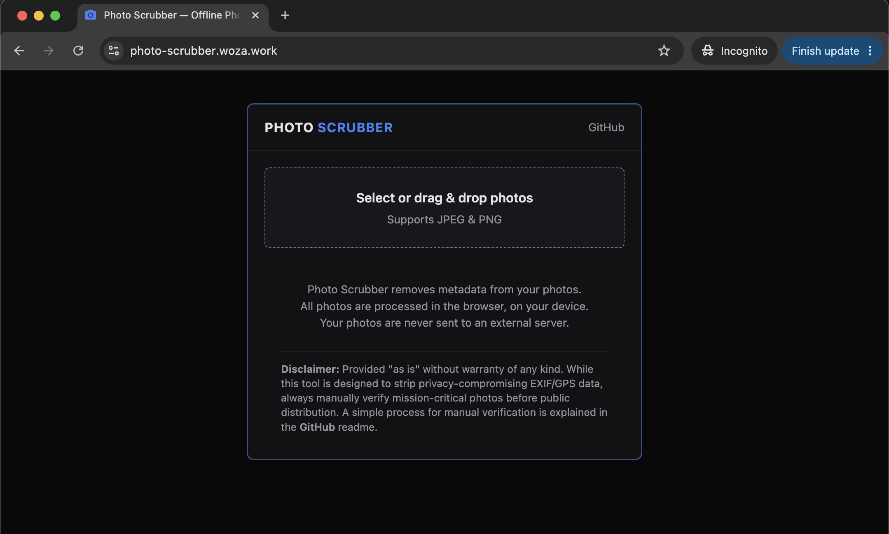

# Offline Photo Scrubber
An offline-first and privacy-first browser based tool to remove hidden EXIF metadata (GPS coordinates, camera serial numbers, timestamps) from PNG and JPG photos.

Live demo: 
https://photo-scrubber.woza.work/

 

Simple UI

 

Most people don’t realize that when they take a photo with a smartphone or digital camera, the device includes hidden metadata (EXIF data) in the image file:

- Exact GPS Coordinates: Pinpointing their home, their child's school, or a secret location.
- Device Footprints: The exact smartphone model, camera serial numbers, and software used.
- Timestamps: The exact second, minute, and date the photo was taken.

This app strips hidden metadata from JPG and PNG images. Use it to remove personally identifiable information before uploading photos to public forums (like GitHub), embedding them in presentations, or sharing with business associates. If you work from home, you don't want online clients knowing exactly where you live.

## Features

- <b>Local Processing</b>: Runs completely in the user's browser via vanilla JavaScript. Because it doesn’t send images to an external server, it offers absolute privacy.

- <b>Lossless Stripping</b>: Most basic tools "clean" an image by rendering it onto a hidden canvas and re-encoding it. That can reduce the picture quality. This code parses the binary chunks of JPEGs and PNGs, cutting out the metadata chunks (APP1 markers for EXIF in JPEGs, eXIf/tEXt chunks in PNGs) without touching the actual image data. The picture quality stays identical to the original image.

- <b>Re-Encoding on Orientation</b>: If an image has an orientation tag (e.g., shot sideways/upside down), the code falls back to re-encoding it at ~92% quality via Canvas to bake the rotation in. This means that it's no longer "lossless" for those specific images. Photos taken with a smartphone have an orientation tag.

- <b>Transparency</b>: You can manually verify that metadata was removed by using the file info inspectors that are built into macOS and Windows (more info below).

## Architecture

- <b>Whitelist Approach</b>: Instead of maintaining a "blacklist" of bad tags (which can easily fail if a new camera format introduces a custom tag), the app uses a whitelist approach via isJpegSegmentEssential and isPngChunkEssential. It strictly looks for the structural blocks required to render the image (like IHDR, PLTE, IDAT for PNGs). If a block isn't strictly necessary to display the pixels, it is discarded by default.

- <b>Verification Pass</b>: The app doesn't blindly trust its own stripping logic. After creating the clean image, it automatically runs a verification scan on the fresh bytes to guarantee that the identifying data is actually gone before displaying the "Save" button.

 

## How to use offline

Simply download the project folder and place it on your desktop. Then double click the index.html file. The app will open in your browser. 

## How to manually verify that metadata has been removed

Both Windows and macOS have built-in inspectors that show basic EXIF and location data.

### On Windows:

- Right-click the downloaded, clean image file and select Properties.

- Go to the Details tab.

- Scroll down to look for sections like Camera (Camera maker, model, focal length) and GPS (Latitude, Longitude). If the file was successfully scrubbed, these fields will either be completely blank or the entire section will be missing.

### On macOS:

- Right-click the clean image file and select Get Info.

- Expand the More Info section.

- If the metadata was successfully removed, details like camera model, lens information, and the "Where" (GPS/map location) data will no longer appear.

 

## Revision History

Version 1.0 
24-June-2026 
First release.

 

